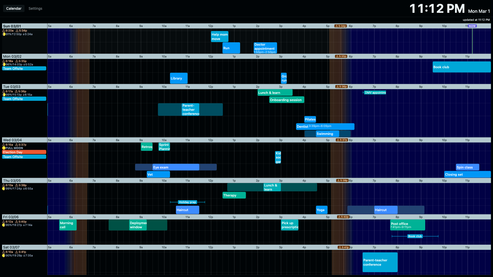

# home-terminal

> **Vibe coded.** This entire project — from architecture to implementation to NixOS deployment config — was written with AI assistance (Claude). It works great. It is not an example of careful software engineering.

A full-screen household dashboard that runs permanently on a Raspberry Pi 4 mounted in the kitchen. It shows a 7-day Gantt-style calendar view with travel time overlays, integrates with Home Assistant for display power control, and computes sunrise/sunset/moon phase locally.



## What it does

- **7-day Gantt calendar** — horizontal timeline, one day per row, time running left-to-right. Events are colored horizontal bars; timed events are positioned precisely, all-day events appear as chips in the left gutter.
- **Two-person household layout** — the view is designed for two people sharing a screen. Each day row has three horizontal sub-rows: person A on top, person B on the bottom, and a shared/unassigned middle lane. Calendars are assigned to people in config; an event appears in the correct sub-row based on which calendar it came from. Events from calendars assigned to both people (e.g. a shared family calendar) appear in the center lane.
- **Multi-source calendars** — fetches from Apple iCloud CalDAV (full 4-step PROPFIND/REPORT discovery) and arbitrary `.ics` feed URLs (e.g. shared Google Calendar links, sports schedules, public holiday feeds). Multiple CalDAV calendars per person are supported.
- **Travel time overlays** — calls the Google Maps Distance Matrix API to compute drive time from home to each event location. A tinted translucent envelope extends the event bar leftward to show "leave by" time. Point-to-point legs (consecutive located events on the same day) are also computed and shown.
- **Sun/moon** — sunrise/sunset/moonrise/moonset and moon phase (emoji + illumination %) computed locally with pure math from configured lat/lon — no API call needed. The timeline has a day/night gradient background, with dashed lines marking sunrise and sunset.
- **Home Assistant integration** — connects to an MQTT broker and registers as a HA device with `display_power` and `dark_mode` switches. Automations in HA can turn the screen on/off (useful for overnight) and toggle light/dark mode. Display on/off is executed via `swaymsg output <name> power on/off`.
- **Settings UI** — toggle calendar visibility, enable/disable travel time per calendar, assign calendars to people, configure person colors via a color-wheel picker.
- **Auto-reload** — if the WebSocket reconnects more than 3 seconds after page load (e.g. after a server restart), the browser reloads to pick up any UI changes.

## Tech stack

**Language:** [Gleam](https://gleam.run/) — statically typed functional language on the Erlang VM (BEAM). The whole thing is Gleam, including the UI.

**UI architecture:** [Lustre](https://hexdocs.pm/lustre/) server components — the Elm-architecture loop runs on the server and pushes HTML diffs over WebSocket. The browser runs only a tiny JS shim. No client-side JS build step.

**HTTP/WebSocket:** [Mist](https://hexdocs.pm/mist/) — pure Erlang HTTP server.

**MQTT:** [spoke_mqtt](https://hexdocs.pm/spoke_mqtt/) — Gleam MQTT client.

**CSS:** Tailwind CSS v4. Dynamic per-person/per-calendar colors use OKLCH inline styles (not Tailwind classes).

**Build/deployment:** [Nix](https://nixos.org/) + [nix-gleam](https://github.com/arnarg/nix-gleam). Production runs as a NixOS systemd service on a Pi 4.

## Running locally

### Prerequisites

- [Nix](https://nixos.org/) with flakes enabled
- [direnv](https://direnv.net/) (optional but recommended)

### Setup

```sh
git clone https://github.com/rtlong/home-terminal
cd home-terminal
cp .env.example .env   # fill in your credentials
direnv allow           # or: nix develop
```

### Environment variables

| Variable | Description |
|---|---|
| `CALDAV_URL` | CalDAV server base URL (e.g. `https://caldav.icloud.com`) |
| `CALDAV_USERNAME` | CalDAV username |
| `CALDAV_PASSWORD` | CalDAV password (Apple: use an app-specific password) |
| `GOOGLE_MAPS_API_KEY` | Google Maps Distance Matrix + Geocoding API key |
| `MQTT_HOST` | MQTT broker hostname |
| `MQTT_USERNAME` | MQTT username |
| `MQTT_PASSWORD` | MQTT password |
| `HA_DEVICE_PREFIX` | HA device identifier / MQTT topic prefix (default: system hostname) |
| `DISPLAY_OUTPUT` | Wayland output name for display power (e.g. `HDMI-A-1`) |
| `DISPLAY_CONTROL_SCHEME` | `swaymsg`, `wlopm`, or `wlr-randr` |
| `PORT` | HTTP port (default: `46548`) |

### Demo mode

No credentials required. Generates a week of deterministic fake events:

```sh
DEMO_MODE=1 gleam run
```

Open `http://localhost:46548`.

### Run with real data

```sh
overmind start   # runs gleam, tailwind watcher, and file watcher concurrently
```

Or individually:

```sh
gleam run        # starts the server on $PORT (default 46548)
```

Open `http://localhost:46548`.

On first run with a `home_address` configured in `~/.config/home-terminal/config.json`, the app will geocode it via Google Maps and write the coordinates back. Subsequent runs skip the geocode call.

## Configuration

Config lives at `$XDG_CONFIG_HOME/home-terminal/config.json` (default: `~/.config/home-terminal/config.json`).

The first time the app starts it writes a default config. You can then edit it to:

- Set your home address / lat-lon for sun/moon calculations
- Configure extra `.ics` feed URLs
- Assign calendars to people
- Adjust person hue angles

## Production deployment (NixOS / Raspberry Pi)

The NixOS module (in a separate private infra repo):

- Builds the Gleam app with `nix-gleam`'s `buildGleamApplication`, including a Tailwind CSS compile step
- Runs it as a systemd service under a dedicated `kiosk` user
- Uses `systemd LoadCredential` for secrets (no env-file needed)
- Runs [sway](https://swaywm.org/) as the Wayland compositor (via greetd) with Chromium in kiosk mode
- Uses a systemd path unit watching `$XDG_RUNTIME_DIR/sway.sock` to sequence startup (home-terminal waits for sway's IPC socket before starting, so display power control is ready immediately)

## Project structure

```
src/
├── home_terminal.gleam  — entry point
├── app.gleam            — HTTP server, WebSocket plumbing
├── tabs.gleam           — Lustre server component (per-connection UI state)
├── cal.gleam            — Gantt view rendering, sun/moon math (~2300 lines)
├── cal_server.gleam     — singleton actor: polls calendars, manages travel cache
├── cal_dav.gleam        — CalDAV HTTP client
├── ical.gleam           — iCalendar RFC 5545 parser (RRULE, EXDATE, TZID, etc.)
├── ical_fetch.gleam     — external .ics feed fetcher
├── ha_client.gleam      — Home Assistant MQTT actor
├── travel.gleam         — Google Maps Distance Matrix client
├── palette.gleam        — OKLCH color palette generation
├── state.gleam          — config/cache file I/O
├── demo_data.gleam      — deterministic fake-data generator for DEMO_MODE
└── ...                  — FFI modules for XML parsing, timezone conversion, signals
```

## License

MIT
